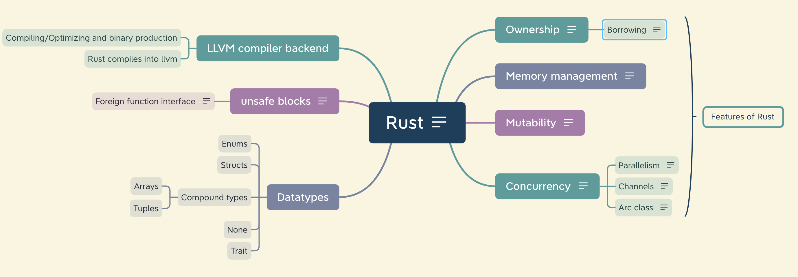
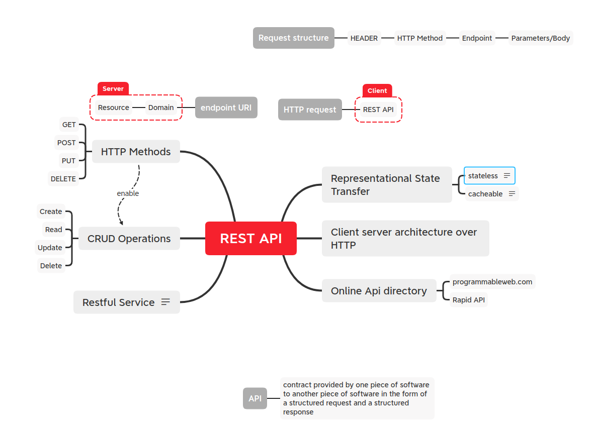
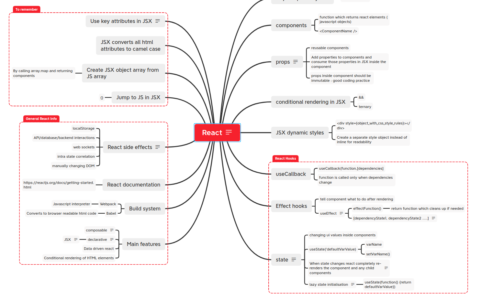
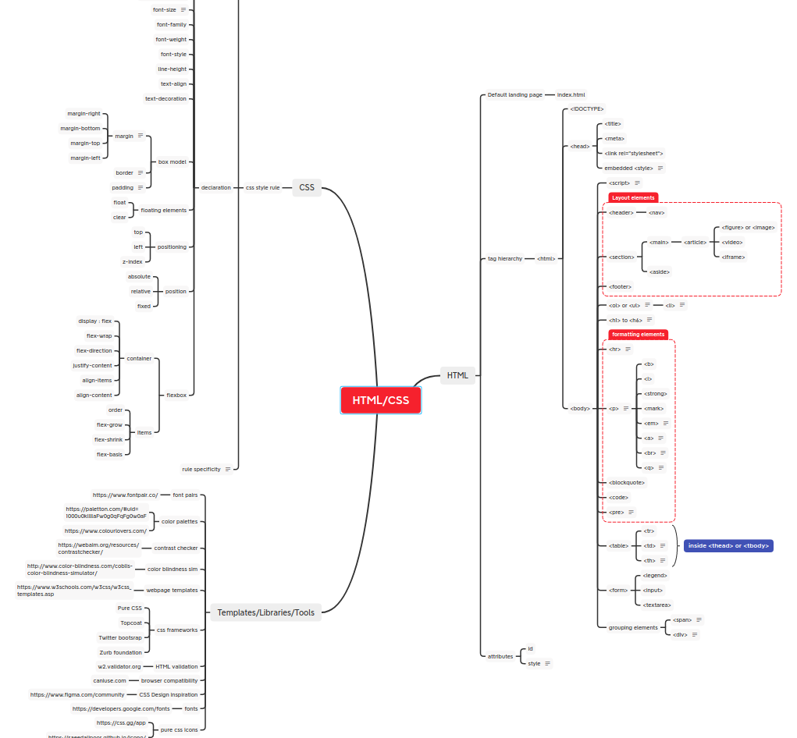
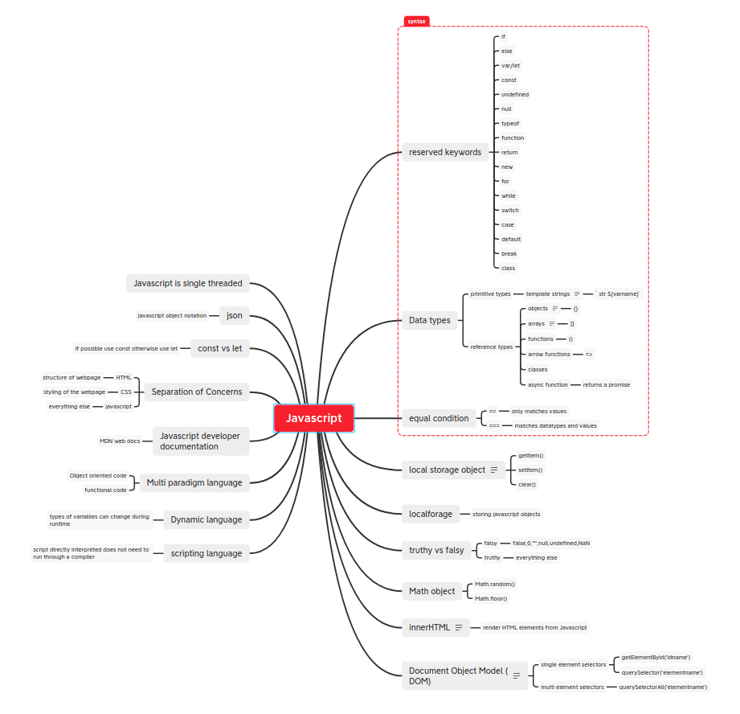
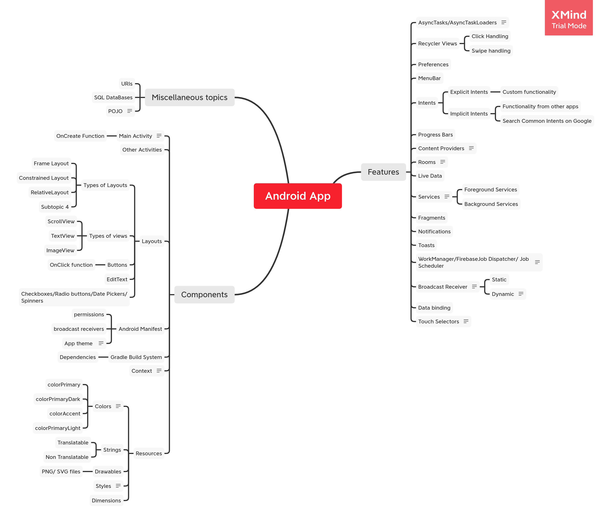
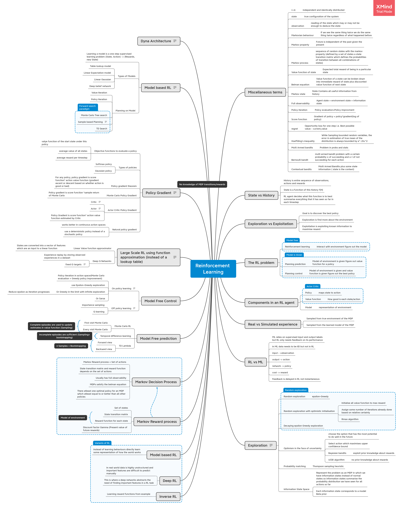
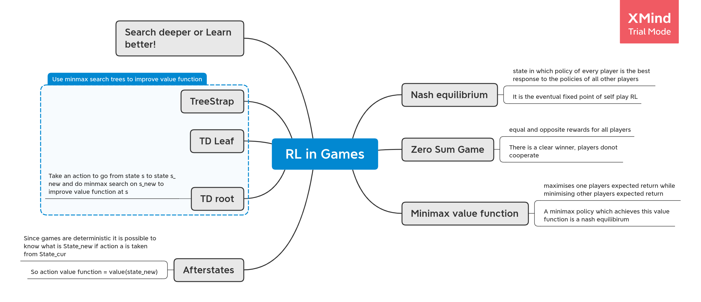

# MindMaps
Backup of Mindmaps for xMind

### Rust

### REST API

### React

### HTML/CSS

### Javascript

### Android development

### Databases

### Reinforcement Learning

Credits : This mindmap is based on Prof. David Silver's course on Reinforcement Learning https://www.davidsilver.uk/teaching/

### Reinforcement Learning in games

